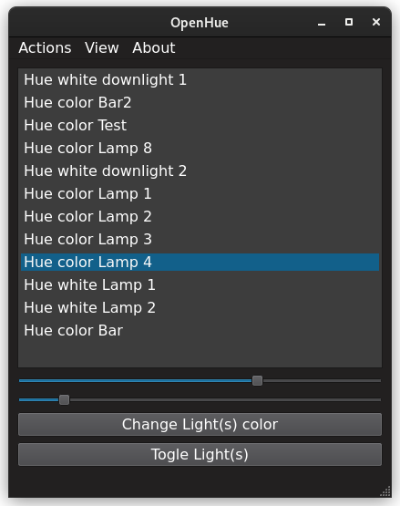
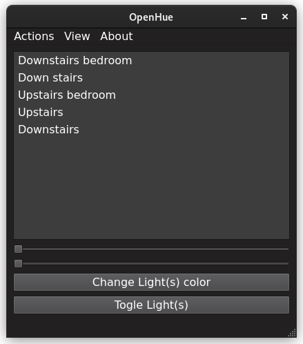
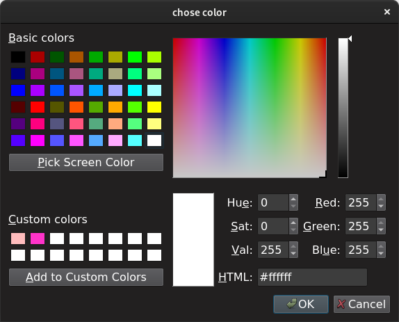

# 💡OpenHue💡

    

A cross platform application to control Philips hue compatible lights.
Licensed under the gpl 3.0 license. Currently in super early version but will be providing binary's for linux and windows soon with mac os binaries at 1.0 release.

## Current Features

- Connect to bridge

- Turn on and off lights

- Change lights color if the selected light supports it. Allows selecting from every possible hexadecimal color value. Also has a eye dropper to pull any color from your screen. You can save theses custom colors for future use.

- Change lights brightness

- Change lights color temperature

- Compact ui

- View bridge info  (ip username key and bridge port)

## Branches

### Main

Were the stable ready to use code exits.(if building frm source use this branch)

### Dev

Where the not yet completed features live might not compile. dev is merged with main after a feature is mature enough.

## How to Build from source (on linux)

- Clone repo, branch main.

- Install cmake, gcc and qt-tools qt6 is a must.

- Install hueplusplus library at [github](https://github.com/enwi/hueplusplus)

- cd into hueplusplus

- Run cmake

- Run make -j4

- Run make install

- Open qt creator and configure then build(qt6 must be the selected qt version in tools->options).

You should now have a executable.

## Contribute

If you want to contribute to the project submitting bugs via github issues is always helpful. If you want to aid in development go to the [CONTRIBUTING.md](CONTRIBUTING.md)

## Copyright

Copyright (c) 2021 BOB450. See LICENSE for further details.
